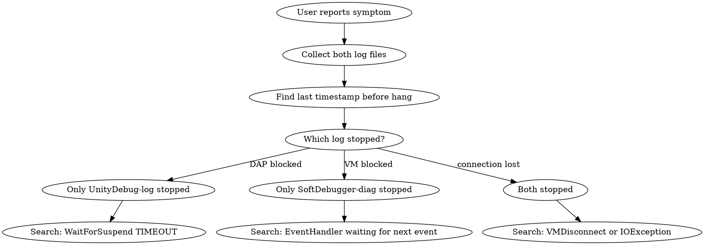

# Debug Log Analysis

## Overview

Diagnose Unity debug adapter issues by analyzing two log files produced at runtime. The adapter has a two-layer architecture: a C# DAP adapter (`UnityDebugSession`) and a lower-level Mono Soft Debugger session (`SoftDebuggerSession`). Each writes its own log. Cross-referencing timestamps across both logs is essential.

## Log File Locations

Both logs are written to the **same directory as `UnityDebug.exe`** (the `bin/` folder of the extension):

| File | Writer | Content |
|------|--------|---------|
| `bin/UnityDebug-log.txt` | `UnityDebug/Log.cs` | DAP-level: requests, responses, events, WaitForSuspend |
| `bin/SoftDebugger-diag.txt` | `debugger-libs/.../SoftDebuggerSession.cs` | VM-level: EventHandler loop, HandleBreakEventSet, Step, Resume |

**Finding the bin path:** The extension's `package.json` `debuggerAdapterExecutable` points to `bin/UnityDebug.exe`. On installed extensions, look in `~/.vscode/extensions/cgame.cgame-unity-debug-*/bin/`.

## Diagnostic Workflow



### Step 1: Identify the Hang Point

Read both logs from the end. Find the last `[DIAG]` line with a timestamp. The gap between the last log line and the user-reported hang time tells you where the system stalled.

### Step 2: Pattern Match Against Known Symptoms

## Known Hang Patterns

### Pattern A: Step Failed Silently (step-in/step-over hangs)

**Symptom:** User clicks Step In, nothing happens.

**In `SoftDebugger-diag.txt` look for:**
```
[DIAG] Step FAILED: <reason>
```
If present followed by `NotifyStepFailed: emitting TargetStopped`, the fix is working.
If you see `Step request failed` WITHOUT `NotifyStepFailed`, the fix is missing — the old silent-swallow bug.

**Root cause:** `Step()` in `SoftDebuggerSession.cs` catches `CommandException` (NOT_SUSPENDED, NO_SEQ_POINT_AT_IL_OFFSET, ERR_UNLOADED) but historically did not fire a TargetStopped event, leaving the DAP layer waiting on `m_ResumeEvent` forever.

**ErrorCode meanings:**
- `NOT_SUSPENDED`: Race condition — VM was briefly resumed by another thread's event processing
- `NO_SEQ_POINT_AT_IL_OFFSET`: PDB mismatch or JIT optimization removed the sequence point
- `ERR_UNLOADED`: AppDomain hot-reload during step
- `INVALID_FRAMEID`: Stack frame invalidated between suspend and step request

### Pattern B: Variable Loading Stuck (breakpoint hit, variables spinning)

**Symptom:** Breakpoint hit, call stack visible, but Variables pane spins forever.

**In `UnityDebug-log.txt` look for:**
```
[DIAG] >>> DAP request 'variables'
```
with NO corresponding response logged after it.

**Root cause candidates:**
1. `ObjectValue.WaitHandle.WaitOne()` / `WaitHandle.WaitAll()` blocking without timeout in `Variables()` method (`UnityDebugSession.cs`). The evaluation requests property getters that deadlock (e.g., getter waits on Unity main thread, which is suspended).
2. `frame.GetThisReference()` / `GetParameters()` / `GetLocalVariables()` in `Scopes()` triggering synchronous VM calls that hang.

**In `SoftDebugger-diag.txt` look for:**
- Any exception after the breakpoint event
- `GetPdbData` or `SourceLink` calls that might hang on protocol mismatch

### Pattern C: Event Queue Deadlock (multi-thread scenarios)

**Symptom:** Debugger freezes after a breakpoint in multi-threaded code.

**In `SoftDebugger-diag.txt` look for:**
```
[DIAG] HandleEventSet: queuing break event (different thread)
```
If many events are queued but never dequeued, the `DequeueEventsForFirstThread` path may be stuck.

### Pattern D: Connection Lost

**Symptom:** Debugger suddenly unresponsive, Unity may also freeze.

**In `SoftDebugger-diag.txt` look for:**
```
[DIAG] EventHandler: exception: IOException / SocketException / VMDisconnectedException
```

### Pattern E: WaitForSuspend Timeout

**Symptom:** Debugger responds after ~60 seconds delay.

**In `UnityDebug-log.txt` look for:**
```
[DIAG] WaitForSuspend(...): TIMEOUT after 60xxxms
```
This means `m_DebuggeeExecuting` was true but no event arrived to set `m_ResumeEvent`. Cross-reference with `SoftDebugger-diag.txt` to find what the VM was doing during those 60 seconds.

## Key Log Markers Reference

| Marker | File | Meaning |
|--------|------|---------|
| `>>> DAP request '<cmd>'` | UnityDebug-log | Incoming DAP request from VS Code |
| `WaitForSuspend(<caller>)` | UnityDebug-log | DAP layer waiting for VM to suspend |
| `EventHandler: waiting for next event` | SoftDebugger-diag | VM event loop idle, waiting for Unity |
| `EventHandler: got event <type>` | SoftDebugger-diag | VM event received |
| `HandleBreakEventSet` | SoftDebugger-diag | Processing break/step/exception event |
| `Step FAILED` | SoftDebugger-diag | Step request rejected by VM |
| `NotifyStepFailed` | SoftDebugger-diag | Recovery: emitting TargetStopped after failed step |
| `safety vm.Resume()` | SoftDebugger-diag | Emergency resume after exception in event handler |
| `HandleEventSet: queuing break event` | SoftDebugger-diag | Cross-thread event queued for later |

## Analysis Checklist

When analyzing a hang from logs:

1. **Timestamp alignment**: Match timestamps across both files to build a unified timeline
2. **Last activity**: What was the last successful operation before the hang?
3. **Pending requests**: Any DAP request sent but never responded to?
4. **VM state**: Was EventHandler waiting for events, or processing one?
5. **Thread context**: Were multiple threads hitting breakpoints simultaneously?
6. **Error swallowing**: Any `catch` that logged an error but didn't recover properly?
7. **Protocol version**: Check `vmVersion=X.Y` lines — low versions (< 2.47) risk NotSupportedException on newer API calls
